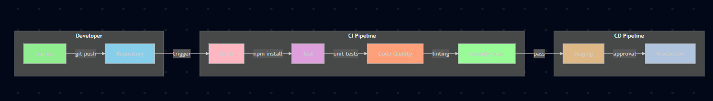

flowchart LR
    subgraph Developer
        A[Commit] -->|git push| B[Repository]
    end
    
    subgraph CI Pipeline
        B -->|trigger| C[Build]
        C -->|npm install| D[Test]
        D -->|unit tests| E[Code Quality]
        E -->|linting| F[Security Scan]
    end
    
    subgraph CD Pipeline
        F -->|pass| G[Staging]
        G -->|approval| H[Production]
    end
    
    style A fill:#90EE90
    style B fill:#87CEEB
    style C fill:#FFB6C1
    style D fill:#DDA0DD
    style E fill:#FFA07A
    style F fill:#98FB98
    style G fill:#DEB887
    style H fill:#B0C4DE

